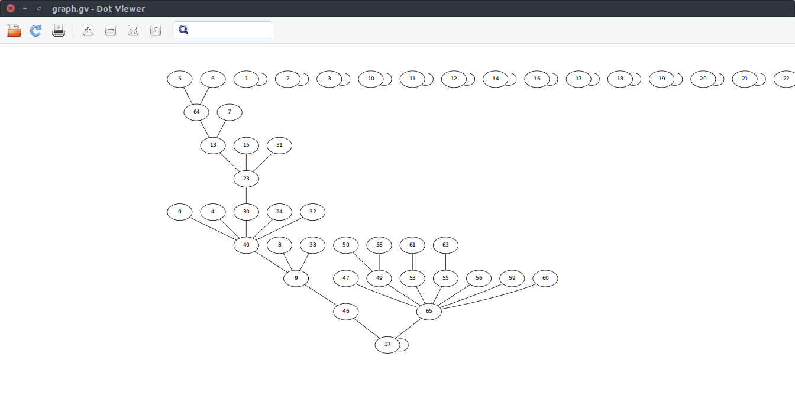
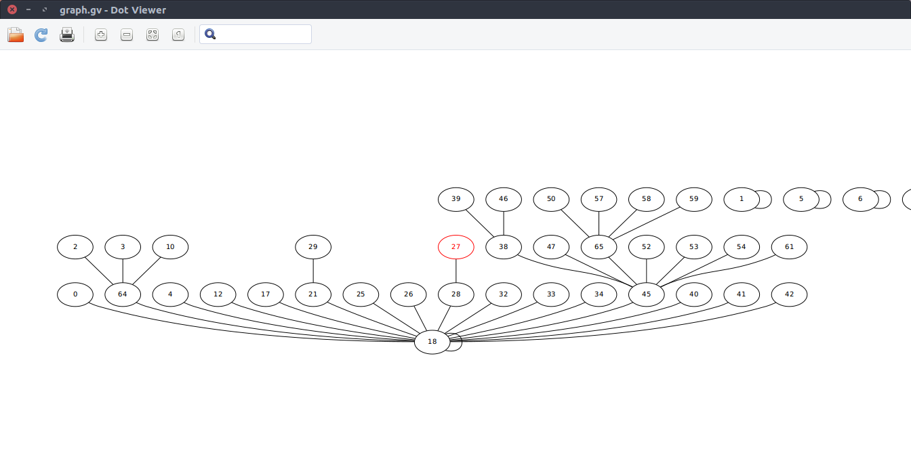

# Overview

This package contains data types and algorithms for the Week 1 programming assignment titled [**Percolation**](https://coursera.cs.princeton.edu/algs4/assignments/percolation/specification.php).

> Write a program to estimate the value of the percolation threshold via Monte Carlo simulation.

## Running the Monte Carlo Simulation

The `test_m_percolations` executable requires 3 arguments
1. size of one dimension of the square percolation grid
2. number of simulations to run
3. `qf`, `qu`, or `wqu`, corresponding to the strategies `QuickFindUF`, `QuickUnionUF`, and `WeightedQuickUnionUF`.

For example,

### WeightedQuickUnion
```
$ ./test_m_percolations 100 100 wqu

p*
--
Mean: 0.588585 , Stdev: 0.014911

wall time
---------
Mean: 0.350000 ms, Stdev: 1.071214 ms

Total simulation time 87.000 ms

```

### QuickFind
```
$ ./test_m_percolations 100 100 qf

p*
--
Mean: 0.587669 , Stdev: 0.014613

wall time
---------
Mean: 28.260000 ms, Stdev: 6.594877 ms

Total simulation time 2871.000 ms
```

### QuickUnion
```
$ ./test_m_percolations 100 100 qu

p*
--
Mean: 0.588391 , Stdev: 0.014847

wall time
---------
Mean: 0.560000 ms, Stdev: 0.778717 ms

Total simulation time 116.000 ms


```

## Graphviz

Each strategy inherits the `AbtractUF` interface, in addition to the implementation of a `writeGraph` method. When enabled in the `test_m_percolations.cpp` file, `writeGraph` will produce a `DOT` format `graph.gv` file, which can be visualized with `xdot`.

### QuickUnion


### WeightedQuickUnion


